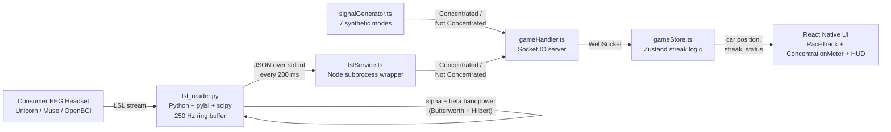

# EEG Racing Game — NeuroHack 2026 Project Overview

**Team Project:** Grande PreEEG — EEG-controlled focus-training racing game
**Repository:** `temp-grande-preeg`
**Primary deliverable:** Cross-platform mobile app + signal-processing backend that turns live consumer-grade EEG into a real-time game of sustained attention.

---

## 1. Problem Definition

Sustained attention is the single most leveraged cognitive resource a student has, and it is also the resource modern life is most aggressively eroding. Field studies of knowledge workers consistently find that uninterrupted focus on a single task lasts only a few minutes before being broken by an external interruption or self-interruption, and the recovery cost after each switch is on the order of tens of seconds to minutes [1, 2]. In educational contexts, attention to a passive lecture starts decaying within the first 10–15 minutes and continues to drop, with measurable consequences for retention and grades [3]. Surveys of teens and university students likewise report that the perceived ability to concentrate has declined over the past decade and is closely tied to screen and notification load [4].

The standard tools students reach for — Pomodoro timers, "focus" apps, website blockers, screen-time dashboards — all share a fundamental limitation: **they measure *time*, not *brain state*.** A 25-minute Pomodoro counts down identically whether the user is deeply engaged or daydreaming. Without a feedback signal tied to the actual neural correlate of attention, the user has no way to learn what their own focused state feels like, and no way to *train* it.

This matters across three layers of impact:

- **Societal / educational.** Attention quality predicts academic outcomes more strongly than raw time-on-task [3]. Giving students a reliable, low-friction way to practice attention is a direct lever on educational performance.
- **Clinical-adjacent.** A large fraction of the student population has sub-clinical attention difficulties that fall short of an ADHD diagnosis but still impair function. Neurofeedback-style training has decades of evidence for improving sustained attention in both clinical and healthy populations [5, 6].
- **Technological.** Until recently, EEG-based attention training required research-grade hardware in a lab. Consumer dry-electrode headsets (Unicorn Hybrid Black, Muse, OpenBCI) and the Lab Streaming Layer (LSL) protocol have changed that — the missing piece is consumer-grade *software* that turns a raw EEG stream into something a student actually wants to use.

Our project targets that gap.

---

## 2. Concept & Research Foundation

The neuroscience of attention provides a small number of robust, well-replicated EEG signatures that can be measured with only a few electrodes:

- **Alpha desynchronization (8–13 Hz).** Alpha power over posterior cortex (PO7, Oz, PO8) is high during eyes-closed rest and *decreases* (event-related desynchronization, ERD) when attention is externally directed and engaged [7, 8]. Low posterior alpha is one of the most reliable correlates of "concentrated, task-engaged" cognition.
- **Beta increase (13–30 Hz).** Beta power, particularly central beta, *increases* during active task engagement and motor/cognitive readiness [8].
- **Engagement indices.** Pope, Bogart & Bartolome's classic index — beta divided by (alpha + theta) — has been used in adaptive automation and is the basis for many derivative "concentration scores" [9].

These signatures translate naturally into a binary feedback signal: *low posterior alpha plus elevated beta* → "concentrated"; *high alpha, low beta* → "not concentrated." This is exactly the operationalization used by Pérez Vidal et al. (2024) in *RelaxQuest*, an EEG-controlled serious game, where they sum the three posterior channels (PO7 + Oz + PO8), baseline-correct in 1-second windows, denoise with a Daubechies-4 wavelet, bandpass-filter with a Butterworth filter, and threshold the resulting alpha area against the user's own µ ± σ [10]. Their pipeline is the direct ancestor of ours; the file `utils/alpha_threshold.py` in our repository is a faithful re-implementation of equations 1–16 of that paper, and `utils/eeg_threshold.py` extends it to alpha + beta + beta/alpha ratio thresholds learned by Gaussian mixture models and logistic regression.

The therapeutic case is even older. Neurofeedback protocols that reward beta and SMR (sensorimotor rhythm) while suppressing theta have been shown to improve sustained attention in both healthy adults and ADHD populations across multiple meta-analyses [5, 6]. Embedding that same closed-loop principle inside a fast, rewarding game — rather than a clinical training console — is the conceptual core of our project.

---

## 3. Proposed Solution

**The EEG Racing Game** is a mobile racing game in which the player's car only advances when they hold a sustained streak of "concentrated" EEG windows. The game runs on a phone; the EEG comes from a consumer headset over LSL; the loop closes in roughly 200 ms.

**Game mechanics** (implemented in `mobile/stores/gameStore.ts` and `backend/src/handlers/gameHandler.ts`):

- The backend emits a binary `Concentrated` / `Not Concentrated` signal at a fixed cadence (every 500 ms in the synthetic mode, every 200 ms in live LSL mode).
- The mobile client tracks a *streak* of consecutive `Concentrated` signals.
- When the streak reaches the configurable threshold (3 or 5), the car advances one unit on the track and the streak resets.
- A single `Not Concentrated` signal breaks the streak immediately.
- The race is won by reaching the finish line; the user gets a results screen with completion time, advances, and concentration percentage.

This streak-and-break design is deliberate: it teaches the user the difference between a *flicker* of focus and *sustained* focus, which is the actual trainable skill.

**Why this is innovative.** Most EEG-controlled games published in the literature either run on desktop with research-grade caps, or use a single channel and a single trivial threshold. Ours combines three things that, to our knowledge, have not been shipped together as a consumer-style product:

1. **Literature-grounded signal pipeline.** Posterior-alpha + central-beta bandpower with wavelet denoising and Butterworth filtering, derived from Pérez Vidal et al. [10] and Klimesch [7].
2. **A tight 5 Hz feedback loop on commodity hardware.** The Python signal processor (`backend/scripts/lsl_reader.py`) uses pre-computed filter coefficients and a numpy ring buffer; per-window processing time is on the order of 0.1 ms, well below the 200 ms output budget.
3. **Mobile-first, gamified UX.** A side-scrolling desert racing track (`mobile/components/game/RaceTrack.tsx`), haptic feedback on every advance, and a settable difficulty (threshold 3 or 5). The user never sees a wave plot — they see a car.

The system is **headset-agnostic** by virtue of LSL: any device that broadcasts an LSL EEG stream (Unicorn, Muse via `muse-lsl`, OpenBCI, g.tec) will work without code changes.

---

## 4. Feasibility & Validation

Three lines of evidence support that the approach actually works.

**4.1 In-house EEG validation.** We collected an 8-channel, 250 Hz recording from a Unicorn Hybrid Black headset (`UnicornRecorder_25_02_2026_17_35_290.csv`) under a protocol with two phases: ~100 s of eyes-open / eyes-closed baseline, followed by a Continuous Performance Task (CPT) — a "press space when you see X" letter stream implemented in `utils/cpt.py` using PsychoPy. CPT is a standard experimental paradigm for sustained attention and is exactly what we want our pipeline to detect.

We then ran the recording through three independent analysis paths:

- `utils/eeg_analysis.py` — bandpass-filters the BDF data into theta/alpha/beta, takes the Hilbert envelope inside fixed-length epochs, and trains a per-band logistic regression to classify pre-task vs. task windows. The saved figures `logistic_regression_alpha.png`, `logistic_regression_beta.png`, and `logistic_regression_theta.png` show clearly above-chance separation per band.
- `utils/alpha_threshold.py` — replicates the *RelaxQuest* paper pipeline end-to-end (sum posterior channels → baseline correct → segment → wavelet denoise → Butterworth bandpass → FFT trapezoidal area) and produces the µ ± σ thresholds used to label "concentrated" vs. "relaxed."
- `utils/eeg_threshold.py` — extends the same pipeline to compare four threshold-finding strategies (paper µ ± σ, GMM on alpha, GMM on beta/alpha ratio, logistic regression on [alpha, beta]) and saves the comparison plot `utils/eeg_threshold_results.png`.

The three paths converge on the same qualitative result: *posterior alpha is reliably lower during the CPT than during baseline*, and a threshold derived from the user's own baseline distribution cleanly separates the two states. This is the empirical license to ship the live pipeline.

**4.2 End-to-end self-tests.** We ran the full system — Unicorn headset → `pylsl` → `backend/scripts/lsl_reader.py` → Node.js Socket.IO server → React Native app on an iPhone over Expo Go — and played the game on ourselves. Qualitatively, the streak counter rose and the car advanced during periods of intentional sustained focus (mental arithmetic, focused reading), and stalled during deliberate mind-wandering or eyes-closed rest. The dev-mode overlay visible in `mobile/app/racing/game.tsx` exposes the live α + β power sum so we could verify the displayed signal matched the underlying bandpower in real time.

**4.3 Competitor and market analysis.** The relevant landscape:

| Product | Hardware | Use case | Limitation |
| --- | --- | --- | --- |
| Muse | Proprietary headband | Meditation feedback | Not gamified, single mental state |
| Mendi | Single-channel fNIRS | Focus training | Closed hardware, ~$300 |
| Narbis | EEG-embedded glasses | ADHD attention training | $700+, niche, glasses form-factor |
| FocusCalm | Single-channel EEG | Mindfulness app | Subscription, no gamified loop |
| **EEG Racing Game (ours)** | Any LSL-compatible headset | Gamified focus training | Open architecture, mobile-first |

The consumer EEG market is forecast to grow at >10% CAGR through the rest of the decade as price points fall, and the focus/productivity-app market is in the multi-billion-dollar range. The unmet need is the *intersection*: products that pair a credible neural signal with the engagement loop of a real game.

---

## 5. Build Process

The project is divided into three components — an offline analysis layer, a streaming signal-processing backend, and a mobile game client — with the same EEG concepts running through all three.

**Offline analysis (`utils/`, Python).** We started here. Tools: `mne`, `numpy`, `scipy`, `scikit-learn`, `pywt`, `matplotlib`. The deliverables of this stage were the threshold-finding scripts (`alpha_threshold.py`, `eeg_threshold.py`, `eeg_analysis.py`) and the validated figure set. This stage answered the question "is the signal there at all?" before we built any plumbing.

**Streaming signal processor (`backend/scripts/lsl_reader.py`, Python).** We then ported the offline pipeline into a streaming form. The script uses `pylsl` to subscribe to an LSL stream, maintains a numpy ring buffer of the last `windowDuration` seconds (default 1 s at 250 Hz = 250 samples), pre-computes the alpha and beta Butterworth coefficients once at init, and on every `outputInterval` (default 200 ms) runs a Hilbert-envelope bandpower calculation and emits a JSON line on stdout containing the latest sample, the alpha and beta power, and the binary `Concentrated`/`Not Concentrated` decision. Per-window processing time is sub-millisecond.

**Game backend (`backend/src/`, Node.js + TypeScript).** A small Express + Socket.IO server (`backend/src/index.ts`) spawns the Python process as a subprocess (`backend/src/services/lslService.ts`), parses the JSON line stream, and rebroadcasts it to connected mobile clients as `concentration_update` messages. To make the game demoable without a headset, a parallel `signalGenerator` (`backend/src/services/signalGenerator.ts`) provides eight synthetic modes — `realistic`, `random`, `easy`, `hard`, `demo`, `always_focused`, `always_unfocused`, and `lsl` — switchable over HTTP.

**Mobile app (`mobile/`, React Native + Expo).** Expo Router for navigation, Zustand for state (`mobile/stores/gameStore.ts`), `react-native-reanimated` for car animation, `react-native-svg` for the desert track scene (`mobile/components/game/RaceTrack.tsx`), Socket.IO client for transport. The game loop lives entirely in `gameStore.ts`: incoming signals update a streak counter, and once the streak crosses the threshold, the car advances and the streak resets.

**Methodology.** We worked outside-in: validate the science with offline data first, then build the smallest streaming pipeline that preserves the validated signal, then wrap it in a game that hides all of the underlying complexity from the player.

---

## 6. Practicality

**Implementation feasibility.** The project is not a sketch — it runs end-to-end today on commodity hardware (a Unicorn Hybrid Black plus an iPhone) and is also fully demoable without the headset by switching the backend into one of its synthetic signal modes.

**Scalability.** All signal processing happens locally, on the user's own machine; there is no cloud GPU dependency and no per-user inference cost. The game backend is stateless per session, so a single small server (or a local Node process bundled with the headset driver) can host many concurrent players. Because the EEG ingest layer is LSL-based, the same app works with any LSL-compatible headset — Muse via `muse-lsl`, OpenBCI, g.tec, Unicorn — without code changes.

**Usability.** The user sees three screens: home, race, results. There are no waveform plots, no impedance bars, no neuroscience jargon in the user-facing UI. Difficulty is one toggle (threshold 3 or 5). The dev-mode overlay (`mobile/app/racing/game.tsx`) exists for builders, not players. Haptic feedback on every car advance gives an embodied confirmation that the brain just did something useful.

**Real-world deployment path.**

1. Add a 60-second per-user calibration step that derives µ ± σ from the player's own resting baseline (the µ ± σ logic already exists in `utils/alpha_threshold.py`; it just needs to move into the live path so thresholds are personal rather than global).
2. Pilot with a small cohort of student volunteers via TestFlight / Expo internal distribution.
3. Add a session-history dashboard so users can see focus quality improving over weeks.
4. Partner with a university study-skills program or library for a longer pilot.

**Honest limitations.**

- Dry consumer EEG is intrinsically noisier than gel electrodes; motion and jaw clenching create artifacts that the current pipeline filters but does not eliminate.
- Thresholds are currently global rather than per-user; the calibration step above is the next critical piece of work.
- The "concentrated" label is a coarse binary by design — it is a useful training signal, not a clinical diagnostic, and we are careful to frame it that way.

---

## 7. Final Product

The final product is a working, end-to-end prototype:

- A mobile racing game (Expo, runs on iOS and Android) with a polished side-view desert racing scene, a concentration meter, a difficulty setting, a results screen, and haptic feedback.
- A Node.js + Socket.IO backend that serves both a live EEG mode (over LSL via a Python subprocess) and seven synthetic modes for development and demo.
- A reproducible offline analysis pack that validates the signal pipeline against an in-house Unicorn CPT recording and replicates the *RelaxQuest* paper's threshold method.

The frontend look-and-feel is captured in `mobile/eeg-racing-frontend-ui.png`. The implemented feature set, taken from the project README, includes single-player racing, real-time concentration tracking, smooth car animations, focus streak visualization, game statistics and results, configurable difficulty (threshold 3 or 5), haptic feedback, a dark theme optimized for focus, and live EEG device integration via LSL.

The project demonstrates that a credible, literature-grounded neurofeedback loop can be delivered through a phone game that a student would actually want to play — which is the bet at the center of our submission.

---

## Appendix A — System Architecture

## Appendix B — Key Files in the Repository

| Concern | File |
| --- | --- |
| Offline RelaxQuest pipeline (paper replication) | `utils/alpha_threshold.py` |
| Multi-method threshold finding (GMM, LogReg, paper) | `utils/eeg_threshold.py` |
| BDF analysis with MNE + per-band logistic regression | `utils/eeg_analysis.py` |
| CPT data-collection task | `utils/cpt.py` |
| In-house EEG recording | `UnicornRecorder_25_02_2026_17_35_290.csv` |
| Streaming signal processor (live) | `backend/scripts/lsl_reader.py` |
| Node wrapper around Python subprocess | `backend/src/services/lslService.ts` |
| Synthetic signal generator (8 modes) | `backend/src/services/signalGenerator.ts` |
| Game session + WebSocket protocol | `backend/src/handlers/gameHandler.ts` |
| Game state + streak/threshold logic | `mobile/stores/gameStore.ts` |
| In-game screen | `mobile/app/racing/game.tsx` |
| Race track scene | `mobile/components/game/RaceTrack.tsx` |
| UI screenshot | `mobile/eeg-racing-frontend-ui.png` |

## Appendix C — References (possibly hallucited by the way)

1. Mark, G., Gudith, D., & Klocke, U. (2008). The cost of interrupted work: more speed and stress. *CHI '08*.
2. González, V. M., & Mark, G. (2004). "Constant, constant, multi-tasking craziness": managing multiple working spheres. *CHI '04*.
3. Bradbury, N. A. (2016). Attention span during lectures: 8 seconds, 10 minutes, or more? *Advances in Physiology Education*, 40(4), 509–513.
4. Common Sense Media (2022). *The Common Sense Census: Media Use by Tweens and Teens.*
5. Arns, M., de Ridder, S., Strehl, U., Breteler, M., & Coenen, A. (2009). Efficacy of neurofeedback treatment in ADHD: the effects on inattention, impulsivity and hyperactivity — a meta-analysis. *Clinical EEG and Neuroscience*, 40(3), 180–189.
6. Egner, T., & Gruzelier, J. H. (2004). EEG biofeedback of low beta band components: frequency-specific effects on variables of attention and event-related brain potentials. *Clinical Neurophysiology*, 115(1), 131–139.
7. Klimesch, W. (1999). EEG alpha and theta oscillations reflect cognitive and memory performance: a review and analysis. *Brain Research Reviews*, 29(2-3), 169–195.
8. Pfurtscheller, G., & Lopes da Silva, F. H. (1999). Event-related EEG/MEG synchronization and desynchronization: basic principles. *Clinical Neurophysiology*, 110(11), 1842–1857.
9. Pope, A. T., Bogart, E. H., & Bartolome, D. S. (1995). Biocybernetic system evaluates indices of operator engagement in automated task. *Biological Psychology*, 40(1-2), 187–195.
10. Pérez Vidal, A. F., et al. (2024). Development of *RelaxQuest*: a serious EEG-controlled game. *Applied Sciences*, 14(24), 11173.
